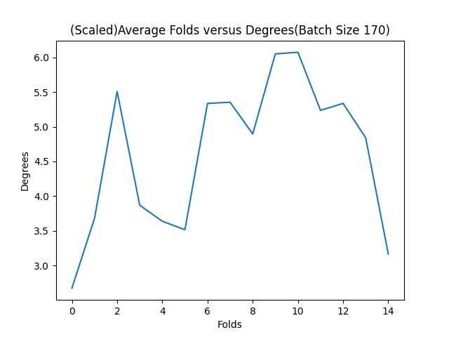
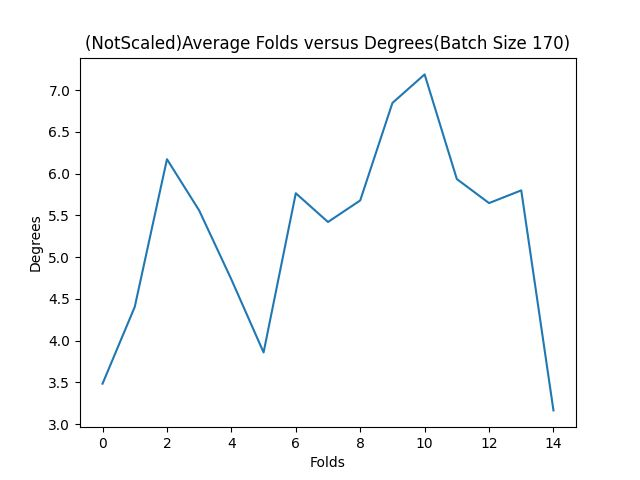
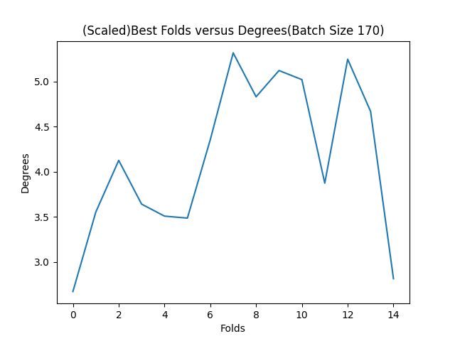
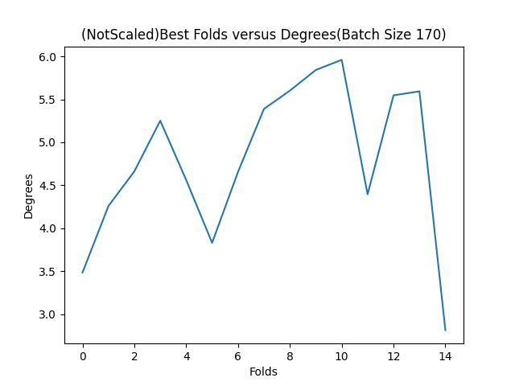
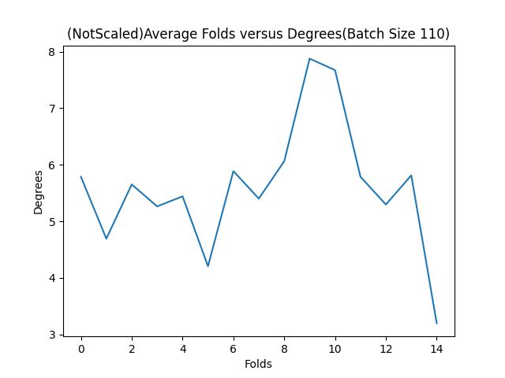
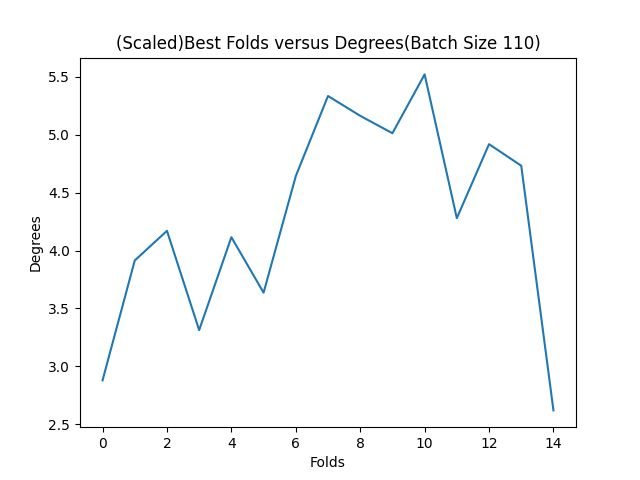
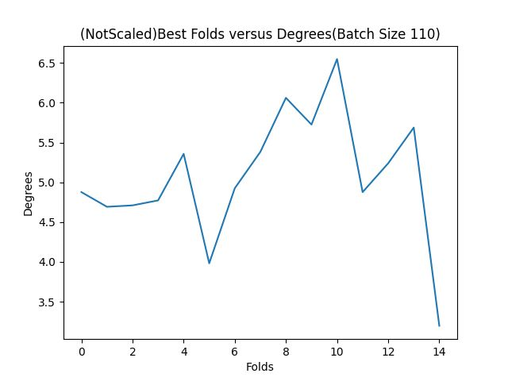

# Reproduction Study
This is a reproduction study of paper in Computer Vision And Machine Learning:
_**It’s Written All Over Your Face: Full-Face Appearance-Based Gaze Estimation**_


## Introduction


## Approach


## Methodology
### Overview
Running the model with the MPIIFaceGaze data was not straightforward. The data used by AFF-net was structured differently than the pre-processed data that was used by the paper. The main difference was that in the Gazecapture data JSON labels were used which contained a “rects” object, this described bounding boxes for the face and eyes. Due to limited and contradictory documentation of the .label labels of our dataset, that was generated by pre-processing code, reconstruction of this object was relatively difficult. The Gazecapture labels also contained an object called 8pts, this is never used so we left it out. These structural differences meant that we had to rewrite the loader class of AFF-net. Furthermore, to automate the training, we implemented leave-one-out in the loader class as well. 
We made major changes to the 2D to 3D conversion script as well as we initially trained and tested on a 11-4 split, this required the conversion to work for multiple test subjects at a time instead of just one. Not all the changes are necessary if one is using leave-one-out, but it does make the script more flexible for possible future use. This script is also where the scaling factor is used and we implemented the ability to easily turn this on or off.
### Data
Both the 2D and 3D dataprocessing scripts need to be run on the MPIIFaceGaze dataset. Both yield cropped images of the face, the eyes and a grid, as well as .label files. The 3D images are identical to the 2D ones and are not used either way so these can be discarded. The grid images are not used either. The model is trained and tested on the 2D dataset, the 3D label files are used for the 2D to 3D conversion. 
### Reader
The 2D .label files have the following structure:
```
Face Left Right Grid Origin whicheye 2DPoint HeadRot HeadTrans ratio FaceCorner LeftEyeCorner RightEyeCorner
```
Of these we use the image paths `face`, `left` and `right`, the ground truth `2DPoint` and the coordinate pairs `FaceCorner`, `LeftEyeCorner` and `RightEyeCorner`. The last three indicate the lower left and upper right corners of their respective bounding boxes. These are used to create rects, which is a list of the x, y coordinates of the lower left corner and the width and height of all three of the bounding boxes, so it has a length of 12.  The subject name, the image paths, the ground truth and rects are saved in a list. The images will then be retrieved and processed by batch in the __getitem__ method. Originally, the images were cropped here as well but this is already handled in the preprocessing. The training and testing hyperparameters are stored in a .yaml file, which we used to automate leave-one-out cross-validation by adding a leave-out parameter and checking for this in the for-subject loop in the loader.
### 2D to 3D conversion
The 3D .label files have the following structure:
```
Face Left Right Origin WhichEye 3DGaze 3DHead 2DGaze 2DHead Rmat Smat GazeOrigin
```
The conversion script uses the rotation matrix `Rmat`, scale matrix `Smat` and `GazeOrigin` from the 3D labels, as well as `screenSize` and `monitorPose` from the camera calibration files in the non-processed dataset. It converts both the prediction and ground truth of the test logs to 3D, so the 3D ground truth `3DPoint` is never used. We added a scale boolean to control whether `Smat` would be used or not. We rewrote the __main__ method so it would convert all test epochs of a single given model. Furthermore we made it able to convert tests done on multiple subjects by checking for the subject name in the __read_line__ function. 


## Results
Results of our different training sessions are shown in the plots below, associated with a more concise table:

                                                               For batch size 170
<br /> <br />
----------------------------
<br /> <br />
----------------------------

From the pictures above we can see that most of the later folds have quite an increase in degree of error. When these samples were left out during the leave-one-out cross-validation sequence, the models had a harder time correctly estimating gaze on, something that was also observed by the other group working on the same dataset.

                                                                For batch size 110
<br /> <br />
----------------------------
<br /> <br />
----------------------------

Similarly to batch size 170 plots, the same samples seem to pose a problem for the trained models.

Table I

|  Batch Size  |  Scaling   | Best Average | Overall average |  SD for best average  | SD for overall average |
|:------------:|:----------:|:------------:|:---------------:|:---------------------:|:----------------------:|
|     170      |    Yes     |   4.15012    |     4.61098     |       0.839635        |        1.05107         | 
|     170      |     No     |   4.78910    |     5.31077     |       0.893591        |        1.12554         | 
|     110      |    Yes     |   4.28300    |     4.70473     |       0.853840        |        1.16285         | 
|     110      |     No     |   5.06958    |     5.60263     |       0.789168        |        1.11690         | 

Table I shows that overall the larger batch size of 170 performed better than the batch size of 110, although not by a significant amount.
However, when tested with a larger batch size of 210, the results were worse than both shown batch sizes. 

These results also show that even with our best scores throughout all epochs averaged, we are still off from the original score of 3.73 by a margin of 0.42, and compared to our overall average over the last epochs, we get a margin of 0.88.

## Analysis


## Discussion

As mentioned in our results section we can see that we are off the original papers degree of error by 0.88 degrees on average and 0.42 at best. We have a couple of suspicions on what could've caused these margins.

### Different AFF net implementation

The original paper did not make available the implementation of AFF-Net that they used. We used an implementation found online from a Github repository linked here: https://github.com/kirito12138/AFF-Net.

There could be a difference between the implementation we have used and what the original paper used, however this is not something that we can know at this time. We suspect that this could be the main reason for our result difference.

### Batch size

There is a batch size difference between the original batch size used by the authors and our own. The authors of the paper did not give any information on the batch size they used, while we used 110, 170 and tested a little on 210. We know that the batch size matters for accuracy as it can determine how much the gradient changes through each step. We took a look at an online discussion on this which goes in more detail:

https://www.kaggle.com/questions-and-answers/185920.

From this discussion we could gather that there could be a significant difference in our results compared to the original authors based on the batch size that they picked.

### Bounding box and seed randomness

The bounding boxes defined in the original implementation are moved randomly between a -30 to 30 pixel range in all directions. We don't do this in our code as it can add some randomness to the results, which may create larger variations in results.

On top of that, the original paper doesn't include whether they set a specific seed for their torch operations or not. We also do not set this seed as we don't think it would introduce a very large difference, however it is worth mentioning that it still is something that can explain part of the margin.


### Changed training procedure

The original paper used multi-gpu parallelization during training. We changed the code to be run on a single-gpu and increased the worker threads. This method could cause some calculating errors to creep up due to the parameter usage from the threads.
