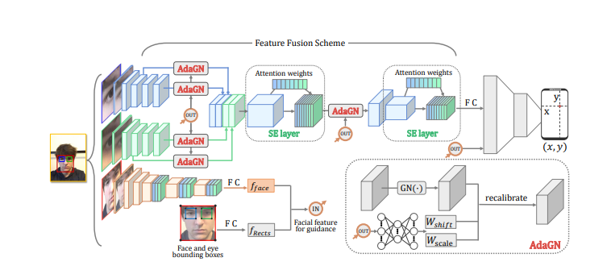
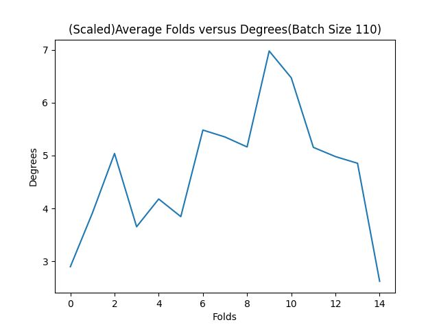

# Reproduction Study
This is a reproduction study of the application of AFF Net in Appearance-based Gaze Estimation on the dataset MPI-Face-gaze. This paper
tries to reproduce both the results of _Appearance-based Gaze Estimation With Deep
Learning: A Review and Benchmark_ and _Adaptive Feature Fusion Network for Gaze
Tracking in Mobile Tablets_ and compare their results.

### Disclaimer
At the outset, the intention was to reproduce the conclusions of the research paper accessible at https://arxiv.org/pdf/2104.12668.pdf and substantiate its outcomes with respect to Eye Diap. However, a hurdle was encountered upon requesting the dataset from the authors, as they failed to respond to the inquiry. Consequently, after a duration of two weeks, the decision was made to shift the focus towards replicating the results with a different dataset. Namely, MPIIFaceGaze.
## Introduction
The potential of gaze tracking in enhancing human-computer interaction and improving the safety of various applications 
has led to a significant interest in this field in recent years. To increase the accuracy of gaze tracking, researchers 
proposed an innovative approach using an Adaptive Feature Fusion Network (AFF-Net) that exploits the similarity between 
eye structures and the face-eye relationship. AFF-Net applies Squeeze-and-Excitation layers to merge two-eye features 
based on their similarity in appearance, and Adaptive Group Normalization to recalibrate eye features by referencing 
facial features. By stacking and fusing two-eye feature maps, AFF-Net integrates the complementary information provided
by the identical structure of the two eyes, resulting in improved gaze tracking accuracy.

The potential applications of AFF-Net are vast, including human attention diagnosis, human-computer interaction in 
mobile devices, and the development of safer driving systems and virtual reality applications. Furthermore, the 
adaptive feature fusion and recalibration techniques employed in AFF-Net can be extended to other multimodal learning tasks, 
where fusing different modalities based on their similarity and relationship can improve performance. 

Previous studies have evaluated AFF-Net on multiple datasets, but this study focuses specifically on two papers, 
namely Papers 1 and 2, which were evaluated on the MPII-FaceGaze dataset. 
</br>

**Both papers utilized a scale factor in their 2D to 3D conversion scripts, and the impact of the scale factor on the results is unknown.
This reproduction study aims to investigate the influence of the scale factor on the results.**

### Paper 1: Appearance-based Gaze Estimation With Deep Learning
Paper 1 presents a comprehensive review and benchmark study of multiple deep learning models for gaze estimation,
including classical CNN-based models, GazeNet, and AFFNET. The models are evaluated on seven publicly available datasets, 
and the results are presented in terms of 2D PoG estimation in centimeters and 3D gaze estimation in degrees.
The study reports an error rate of 4.21 cm for 2D PoG and 3.73 degrees for 3D gaze for the MPI-FaceGaze dataset using AFF-Net.


### Paper 2: Adaptive Feature Fusion Network for GazeTracking in Mobile Tablets
IIn Paper 2, the authors propose AFF-NET  to enhance gaze tracking on mobile tablets 
by merging features from various sources, such as RGB images, depth maps, and optical flow fields.
 AFF-NET includes an adaptive feature fusion module that learns weights to balance the importance of different modalities for gaze estimation.
The paper evaluates the efficacy of  AFF-NET on the MPI-FaceGaze dataset and compares it with various state-of-the-art gaze tracking methods.
The results are reported as 2D PoG accuracy of 3.9 cm and 3D gaze error of 4.4 degrees for MPI-FaceGaze.


### AFF-NET 
<p align="center">

<p >

The AFF-Net is a neural network architecture that aims to improve eye tracking accuracy by utilizing the similarity of two eyes' appearances to adaptively fuse eye features and guide eye feature extraction with face appearance characteristics. One of the key components of the AFF-Net architecture is the eye feature fusion structure that contains eye feature stacking and Squeeze and Excitation (SE) layers for adaptive eye fusion. The SE layer is a powerful structure that applies attention to different eye features from different channels. It compresses every channel of the input feature to a single value using a Global Average Pooling (GAP) layer and then applies fully connected (FC) layers and a sigmoid function to calculate a weight vector that is used to derive the final result. The SE layer allocates attention to different channels according to cross-channel relationships, making it suitable for two-eye relationship-based eye feature fusion.

The eye feature fusion structure in the AFF-Net architecture ensures that spatial and cross-channel information is not lost when reshaping feature maps to feature vectors and processing them with fully connected layers during eye feature fusion. Eye feature maps from different layers are stacked in channel wise, and SE layers are added before and after eye feature stacking to dynamically adjust channel-wise features, enhance the representational power of the network, and adaptively balance spatial information and complex features from left and right eyes according to their appearance and relationship. The SE layer plays a crucial role in the eye feature fusion process by allocating attention to different channels according to their cross-channel relationships.

The shared weights CNN is another key component of the AFF-Net architecture used to ensure that the extraction of two eye features is identical. Shared weights CNN is used to process eye images, and the appearance of the two eyes is kept consistent by flipping right eye images horizontally during data processing. This ensures that the position of inner and outer eye corners and the direction of eyebrows are consistent in left and right eye images, making it easier for the shared weights Eye Net to extract eye features like iris for different appearances.

Finally, to fuse facial features for better gaze estimation, the AFF-Net architecture proposes Adaptive Group Normalization (AdaGN), which adequately utilizes facial feature guidance. AdaGN takes concatenated Rects features and facial features as input to represent face appearance characteristics and adaptively adjusts eye feature extraction according to those characteristics by recalibrating eye features. According to different combinations of head pose, light condition, and other factors reflected in facial appearance characteristics, AdaGN calculates scale and shift parameters to enhance the representational power of normalized features.

In summary, the AFF-Net architecture utilizes attention layers, such as the SE layer, to dynamically adjust channel-wise features and allocate attention to different eye features according to cross-channel relationships during eye feature fusion. Additionally, the shared weights CNN is used to ensure identical extraction of two eye features, while AdaGN adapts eye feature extraction according to facial appearance characteristics. These components work together to enhance the accuracy of eye tracking by adaptively fusing eye features and guiding eye feature extraction with face appearance characteristics.

## Approach
In order to reproduce the findings of the paper on MPII-FACE-GAZE, the authors provided the preprocessing code and 2D to 3D conversion codes, which were made available at https://phi-ai.buaa.edu.cn/Gazehub/. However, the actual model, as well as the training and test codes, were not provided, prompting us to utilize the codes and model provided in the Github repository at https://github.com/kirito12138/AFF-Net. The author of the repository cited the original paper but acknowledged that the data loader codes were not universal with the original paper.
The following scripts were given: 

- data_processing_core.py
- data_processing_mpii.py
- train.py
- reader.py
- test.py
- train.py
- Json label Files(without data)

Although these scripts were available, they were primarily designed for the GazeCapture dataset, and therefore required 
modifications for the reproduction of the MPIFaceGaze Dataset. To achieve this, the MPI-preprocessing.py and reader.py 
scripts were modified to accommodate the MPI-FACE-Gaze format, while train.py was changed to use single GPUs over 
multiple cores in the data loader, as it was initially built for multi-GPU training. Do note that the Json label Files
were used as inspiration to understand the format for MPI-preprocessing.py and reader.py.


The specifications of the two computers are:
-   **CPU :  i9-11900KF, Ryzen 5** 
-   **GPU :  3050-TI, 3070-TI**

Notably, the original batch size used in the paper was 250, but both GPUs were unable to process this batch size. As a result, Computer 1 was trained on 110 while Computer 2 was trained on 170. The results from both computers were then aggregated for the final analysis, which is presented in the later section of this readme. It is important to note that a leave-one-out approach was used for training, consistent with the original paper, in an effort to reproduce the actual result.
The original paper also employed a scale factor for the conversion of 2D to 3D, as explained in the methodology section. To investigate the influence of this scale factor, we obtained results for both scaled and non-scaled conversion scripts. 
The resulting degrees are summarized in the result section.


## Methodology
### Overview
Running the model with the MPIIFaceGaze data was not straightforward. The data used by AFF-net was structured differently than the pre-processed data that was used by the paper. The main difference was that in the Gazecapture data JSON labels were used which contained a “rects” object, this described bounding boxes for the face and eyes. Due to limited and contradictory documentation of the .label labels of our dataset, that was generated by pre-processing code, reconstruction of this object was relatively difficult. The Gazecapture labels also contained an object called 8pts, this is never used so we left it out. These structural differences meant that we had to rewrite the loader class of AFF-net. Furthermore, to automate the training, we implemented leave-one-out in the loader class as well. 
We made major changes to the 2D to 3D conversion script as well as we initially trained and tested on a 11-4 split, this required the conversion to work for multiple test subjects at a time instead of just one. Not all the changes are necessary if one is using leave-one-out, but it does make the script more flexible for possible future use. This script is also where the scaling factor is used and we implemented the ability to easily turn this on or off.
### Data
Both the 2D and 3D dataprocessing scripts need to be run on the MPIIFaceGaze dataset. Both yield cropped images of the face, the eyes and a grid, as well as .label files. The 3D images are identical to the 2D ones and are not used either way so these can be discarded. The grid images are not used either. The model is trained and tested on the 2D dataset, the 3D label files are used for the 2D to 3D conversion. 
### Reader
The 2D .label files have the following structure:
```
Face Left Right Grid Origin whicheye 2DPoint HeadRot HeadTrans ratio FaceCorner LeftEyeCorner RightEyeCorner
```
Of these we use the image paths `face`, `left` and `right`, the ground truth `2DPoint` and the coordinate pairs `FaceCorner`, `LeftEyeCorner` and `RightEyeCorner`. The last three indicate the lower left and upper right corners of their respective bounding boxes. These are used to create rects, which is a list of the x, y coordinates of the lower left corner and the width and height of all three of the bounding boxes, so it has a length of 12.  The subject name, the image paths, the ground truth and rects are saved in a list. The images will then be retrieved and processed by batch in the __getitem__ method. Originally, the images were cropped here as well but this is already handled in the preprocessing. The training and testing hyperparameters are stored in a .yaml file, which we used to automate leave-one-out cross-validation by adding a leave-out parameter and checking for this in the for-subject loop in the loader.
### 2D to 3D conversion
The 3D .label files have the following structure:
```
Face Left Right Origin WhichEye 3DGaze 3DHead 2DGaze 2DHead Rmat Smat GazeOrigin
```
The conversion script uses the rotation matrix `Rmat`, scale matrix `Smat` and `GazeOrigin` from the 3D labels, as well as `screenSize` and `monitorPose` from the camera calibration files in the non-processed dataset. It converts both the prediction and ground truth of the test logs to 3D, so the 3D ground truth `3DPoint` is never used. We added a scale boolean to control whether `Smat` would be used or not. We rewrote the __main__ method so it would convert all test epochs of a single given model. Furthermore we made it able to convert tests done on multiple subjects by checking for the subject name in the __read_line__ function. 


## Results
Results of our different training sessions are shown in the plots below, associated with a more concise table:

                                                               For batch size 170
<br /> <br />
----------------------------
<br /> <br />
----------------------------

From the pictures above we can see that most of the later folds have quite an increase in degree of error. When these samples were left out during the leave-one-out cross-validation sequence, the models had a harder time correctly estimating gaze on, something that was also observed by the other group working on the same dataset.

                                                                For batch size 110
<br /> <br />
----------------------------
<br /> <br />
----------------------------

Similarly to batch size 170 plots, the same samples seem to pose a problem for the trained models.

Table I

|  Batch Size  |  Scaling   | Best Average | Overall average |  SD for best average  | SD for overall average |
|:------------:|:----------:|:------------:|:---------------:|:---------------------:|:----------------------:|
|     170      |    Yes     |   4.15012    |     4.61098     |       0.839635        |        1.05107         | 
|     170      |     No     |   4.78910    |     5.31077     |       0.893591        |        1.12554         | 
|     110      |    Yes     |   4.28300    |     4.70473     |       0.853840        |        1.16285         | 
|     110      |     No     |   5.06958    |     5.60263     |       0.789168        |        1.11690         | 

Table I shows that overall the larger batch size of 170 performed better than the batch size of 110, although not by a significant amount.
However, when tested with a larger batch size of 210, the results were worse than both shown batch sizes. 

These results also show that even with our best scores throughout all epochs averaged, we are still off from the original score of 3.73 by a margin of 0.42, and compared to our overall average over the last epochs, we get a margin of 0.88.

## Analysis


## Discussion

As mentioned in our results section we can see that we are off the original papers degree of error by 0.88 degrees on average and 0.42 at best. We have a couple of suspicions on what could've caused these margins.

### Different AFF net implementation

The original paper did not make available the implementation of AFF-Net that they used. We used an implementation found online from a Github repository linked here: https://github.com/kirito12138/AFF-Net.

There could be a difference between the implementation we have used and what the original paper used, however this is not something that we can know at this time. We suspect that this could be the main reason for our result difference.

### Batch size

There is a batch size difference between the original batch size used by the authors and our own. The authors of the paper did not give any information on the batch size they used, while we used 110, 170 and tested a little on 210. We know that the batch size matters for accuracy as it can determine how much the gradient changes through each step. We took a look at an online discussion on this which goes in more detail:

https://www.kaggle.com/questions-and-answers/185920.

From this discussion we could gather that there could be a significant difference in our results compared to the original authors based on the batch size that they picked.

### Bounding box and seed randomness

The bounding boxes defined in the original implementation are moved randomly between a -30 to 30 pixel range in all directions. We don't do this in our code as it can add some randomness to the results, which may create larger variations in results.

On top of that, the original paper doesn't include whether they set a specific seed for their torch operations or not. We also do not set this seed as we don't think it would introduce a very large difference, however it is worth mentioning that it still is something that can explain part of the margin.


### Changed training procedure

The original paper used multi-gpu parallelization during training. We changed the code to be run on a single-gpu and increased the worker threads. This method could cause some calculating errors to creep up due to the parameter usage from the threads.


# Citations
_Cheng, Yihua & Wang, Haofei & Bao, Yiwei & Lu, Feng. (2021). Appearance-based Gaze Estimation With Deep Learning: A Review and Benchmark._ 

_Bao, Y., Cheng, Y., Liu, Y., & Lu, F. (2021). Adaptive Feature Fusion Network for Gaze Tracking in Mobile Tablets. In 2020 25th International Conference on Pattern Recognition (ICPR) (pp. 9936-9943). IEEE. doi: 10.1109/ICPR48806.2021.9412205*_
